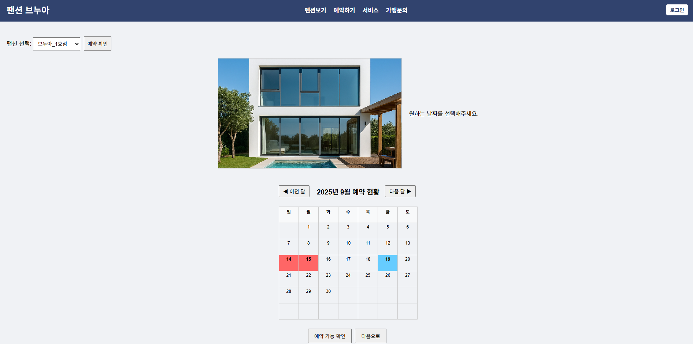

# 🏡 팬션 예약 웹사이트

## 📖 프로젝트 소개
간단한 팬션 예약 시스템을 구현한 웹사이트입니다.  
사용자가 원하는 날짜와 객실을 선택해 예약할 수 있도록 제작했습니다.  

## 🛠 기술 스택
- Frontend: HTML, CSS, JavaScript  
- Backend: Node.js (Express)  
- Database: MySQL  

## ✨ 주요 기능
- 회원가입 및 로그인  
- 예약하기 / 예약 내역 조회  
- 관리자 페이지 (예약 관리)  

## 📸 화면 예시
  
  

## 🚀 실행 방법
```bash
# 저장소 클론
git clone https://github.com/사용자명/pension-reservation.git

# 프로젝트 폴더 이동
cd pension-reservation

# 패키지 설치
npm install

# 서버 실행
npm start
